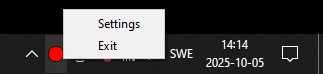
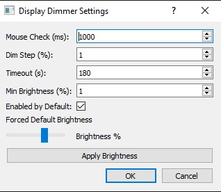

# screenDim - smart screen dimming for multi-monitor setups
ScreenDim automatically dims inactive displays in multi-monitor environments: 
- helping you save energy,
- reduce eye strain,
- and extend screen lifespan (especially for OLED technology),
- all without breaking your window layout.

When working on multiple screens, you often focus on just one for long periods — reading, coding, or designing — while the others stay on, wasting power and distracting your eyes.
Turning those displays off completely isn’t ideal either: Windows repositions your open windows and icons when a monitor disconnects.

screenDim solves this by detecting inactivity on each display and smoothly dimming unused screens instead of turning them off. Once you move your mouse back to a dimmed screen, it brightens instantly and returns to normal.

## 🖼️ Interface Overview

### 🧭 Tray Icon States  
Left-click to toggle **ON/OFF** · Double-click to **Exit**

  
  &nbsp;&nbsp;
  

---

### ⚙️ Tray Menu (Right-Click)

  

---

### 🪟 Settings Window (Exported to JSON)

  

---

# HOW TO RUN:
1) pip install monitorcontrol pyqt5 pyautogui wmi
2) python screenDimmer.py

# HOW IT WORKS:
1) A tray icon appeears
2) Single-click on icon to toggle active/inactive
3) Double-click to exit the program
4) Right-click to display the settings (saved to a .json file)
5) If active, program checks mouse activity on every disaply
6) If no mouse activity, then display is slowly being turned off (brightness -> low & pixels -> black)
7) On mouse movement, the display goes back to original state
8) Idea is to avoid switching off displays completely so the operating system does not mess up the windows arrangement

# TODOs:
- Potential issue: May firstly check if "readLuminance" worked (try), and only if worked assign level_default !
- May use some power-saving mode for modern display (still keeping display detected by the operating system)
- May apply semi-transparent background for older displays to achive gradient dimming
- Full testing and adaptation to different OS (was written on Windows)
- Apply the dim-layer to all virtual desktops (not only the current one)
- Do not display the dim-layer window as a program in the bottom bar; do not disturb user when applying the dim-layer
